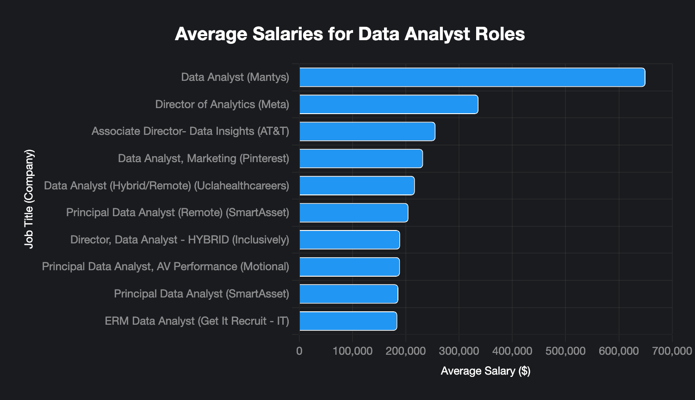

# Introduction
Let's dive into the data job market in 2023!!! Focusing on remote Data Analyst roles, this project explores high-paying jobs, in-demand skills, and where high demands meet high salary in Data Analytics.

Check out the SQL Queries here: [[Project SQL](project_sql)]
# Background
Driven by the aspiration of exploring the career opportunities of Data Analytics, this project was born to pinpoint the top paying roles and in-demand skills. Besides, this project enables me to practice my SQL skills through practical queries.

Data hails from my [SQL Course](https://www.youtube.com/watch?v=7mz73uXD9DA&t=12494s). It's packed with useful instructions and practice problems for beginners to explore the SQL world. 
### The Questions I want to answer from this project:
- What are the top-paying Data Analyst jobs?
- What skills are required for those top-paying jobs?
- What skills are most in demand for Data Analysts?
- What are the highest paid skills on average?
- What are the most optimal skills to learn?
# Tools I used
For my deep dive into the data analyst job market, I harnessed the power of several primary tools:
- **SQL:** The backbone of my analysis, enabling me to query complex databases and discover valuable insights.
- **PostgreSQL:** The chosen database management system, optimal for handling the job posting data.
- **Visual Studio Code:** My go-to for executing SQL queries and managing database.
- **GitHub:** Essential for version control and sharing queries, enabling collaboration and project tracking.
# The analysis
Each query of this project aimed at providing insights into specific aspects of the data analyst job market. Here's how I approached each of the questions:

### 1. Top Paying Data Analyst Jobs
To specify the highest-paying roles, I filtered data analyst positions by average yearly salary and job location, concentrating merely on remote positions. This query underscores the high-paying job prospects in the field. 

```sql
SELECT
    job_title,
    job_location,
    cd.name AS company_name,
    job_schedule_type,
    salary_year_avg AS avg_salary
FROM
    job_postings_fact AS jp
LEFT JOIN company_dim as cd ON cd.company_id = jp.company_id
WHERE
    job_title_short = 'Data Analyst'
    AND job_location = 'Anywhere'
    AND salary_year_avg IS NOT NULL
ORDER BY    
    salary_year_avg DESC
LIMIT 10
```
### Here's the breakdown of the top Data Analyst jobs in 2023:
🔍 Key Insights
- 💰 Record-breaking salary: The highest-paying role is Data Analyst at Mantys, with an average annual salary of $650,000, nearly double the next highest role.

- 🏢 Repeat performer: SmartAsset appears twice in the list, both times for Principal Data Analyst roles.

- 🌍 100% remote: Every role is full-time and fully remote (“Anywhere”), reflecting strong demand for location-flexible talent.

- 📈 Salary spread: Annual salaries range from $184,000 to $650,000, with a sharp drop after the top three positions.

- 📊 Career ladder: The list spans mid-level analyst roles to senior leadership positions like Director of Analytics and Associate Director – Data Insights.

- 🎯 Industry diversity: Companies range from tech giants (Meta, Pinterest) to healthcare, fintech, telecom, and autonomous vehicles, showing cross-industry demand for data analytics expertise.

*Bar graph visualizing the top 10 salaries for data analysts; Grok generated this graph from my own query results.*
### 2. Skills Required For Top Paying Jobs
To specify the skills required in the highest-paying data analyst positions, I joined the previous top paying jobs table to the skills dimension table. 
```sql
WITH top_paying_jobs AS (
    SELECT  
        job_id,
        job_title,
        cd.name AS company_name,
        salary_year_avg
    FROM
        job_postings_fact AS jp
    LEFT JOIN company_dim as cd ON cd.company_id = jp.company_id
    WHERE
        job_title_short = 'Data Analyst'
        AND job_location = 'Anywhere'
        AND salary_year_avg IS NOT NULL
    ORDER BY    
        salary_year_avg DESC
    LIMIT 10
)

SELECT 
    top_paying_jobs.*,
    skills.skills
FROM top_paying_jobs
INNER JOIN skills_job_dim ON skills_job_dim.job_id = top_paying_jobs.job_id
INNER JOIN skills_dim AS skills ON skills.skill_id = skills_job_dim.skill_id
ORDER BY 
    salary_year_avg DESC
```
### Here's the breakdown of the skills required in top paying jobs:
🔑 Skill Insights:

- **🥇 SQL:** Required by all 8 roles.
- **🐍 Python:** 7 roles. 
- **Tableau:** 6 roles. 
- **R, Snowflake, Excel, Pandas, Azure, AWS:** 3-4 roles each.
- **🔍 Other skills (e.g., Go, NumPy, Crystal):** 1-2 roles, showing diverse needs.
- **🌟 AT&T’s role:** Most skills (13). Get It Recruit - IT: Fewest (3).

.png)
*Bar graph visualizing the skill frequency in top paying Data Analyst roles; Grok generated this graph from my own query results.*
### 3. Most in-demand skills
To specify the skills with highest demands, I used the COUNT aggregation to find how many times the skills are mentioned, then grouped by the skill names. I also joined the skills dimension table and the skills to job dimension table to the main job postings table. 
```sql
SELECT 
    skills.skills,
    COUNT (job_postings_fact.job_id) AS demand_num
FROM
    job_postings_fact 
INNER JOIN skills_job_dim ON skills_job_dim.job_id = job_postings_fact.job_id
INNER JOIN skills_dim AS skills ON skills.skill_id = skills_job_dim.skill_id
WHERE
    job_title_short = 'Data Analyst' AND
    job_work_from_home = TRUE
GROUP BY    
    skills.skills
ORDER BY
    demand_num DESC
LIMIT 5
```
### Here's the breakdown of the most in-demand skills:
🔑 Skill Insights:

- **🥇 SQL:** Leads with 7,291 roles, a must-have for data analytics. 🗄️
- **📋 Excel:** 4,611 roles, essential for data tasks. 📊
- **🐍 Python:** 4,330 roles, vital for advanced analytics. 🛠️
- **📈 Tableau:** 3,745 roles, key for visualizations. 🎨
- **🔍 Power BI:** 2,609 roles, growing in business intelligence. 📉
.png)
*Bar graph visualizing the demands of skills in Data Analyst roles; Grok generated this graph from my own query results.*

### 4. Top Paying Skills
To specify the skills with the highest-paying, I used the AVG aggregation to find out the yearly salary of each skill on average, then ordered by the average salary.
```sql
SELECT 
    skills.skills,
    ROUND (AVG (job_postings_fact.salary_year_avg), 0) AS avg_salary
FROM
    job_postings_fact 
INNER JOIN skills_job_dim ON skills_job_dim.job_id = job_postings_fact.job_id
INNER JOIN skills_dim AS skills ON skills.skill_id = skills_job_dim.skill_id
WHERE
    job_title_short = 'Data Analyst' AND
    salary_year_avg IS NOT NULL
GROUP BY    
    skills.skills
ORDER BY
    avg_salary DESC
LIMIT 25
```
### Here's the breakdown of the highest paid skills:
🔑 Skill Salaries Insights

- **🥇 Pyspark:** Highest average salary at $208,172, in high demand for big data processing. 🗄️
- **🥈 Bitbucket:** Strong average salary of $189,155, valued for version control and collaboration. 🔄
- **🥉 Couchbase/Watson:** Both at $160,515, sought after for NoSQL databases and AI-driven analytics. 🤖
- **📊 Pandas:** Average salary of $151,821, a cornerstone for Python-based data analysis. 🐼
- **🔍 Databricks:** Average salary of $141,907, growing in unified data analytics platforms. ☁️
.png)
*Bar graph visualizing the average skill salaries in Data Analyst roles; Grok generated this graph from my own query results.*

### 5. Optimal skills to learn
To specify the most optimal skills to learn in the Data Analyst job market, I sorted the skills based on their demands and their average yearly salaries. 
```sql
SELECT 
    skills_dim.skill_id,
    skills_dim.skills,
    COUNT (skills_job_dim.job_id) AS demand_num,
    ROUND (AVG (job_postings_fact.salary_year_avg), 0) AS avg_salary
FROM 
    job_postings_fact
INNER JOIN skills_job_dim ON skills_job_dim.job_id = job_postings_fact.job_id
INNER JOIN skills_dim ON skills_dim.skill_id = skills_job_dim.skill_id
WHERE
    job_title_short = 'Data Analyst' AND
    job_work_from_home = TRUE AND
    salary_year_avg IS NOT NULL
GROUP BY
    skills_dim.skill_id
HAVING 
    COUNT (skills_job_dim.job_id) > 10
ORDER BY
    avg_salary DESC,
    demand_num DESC
LIMIT 25
```
### Here's the breakdown of the optimal skills:
🔑 Skill Insights

- **Python:** Tops demand with 236 roles, average salary of $101,397, ideal for versatile data analytics and programming. 🐍
- **Tableau:** High demand with 230 roles, average salary of $99,288, optimal for mastering data visualization. 📊
- **R:** Strong demand with 148 roles, average salary of $100,499, excellent for statistical analysis and research. 📈
- **SAS:** Solid demand with 63 roles, average salary of $98,902, valuable for advanced analytics and reporting. 📉
- **Looker:** Notable demand with 49 roles, average salary of $103,795, a smart choice for business intelligence expertise. 🔍

| Skills      | Demand (Roles) | Average Salary ($) |
|------------|----------------|--------------------|
| Python     | 236            | 101,397            |
| Tableau    | 230            | 99,288             |
| R          | 148            | 100,499            |
| SAS        | 63             | 98,902             |
| Looker     | 49             | 103,795            |

*Table of the optimal skills to learn, based on their demands and average salaries*
# What I learned
Throughout this adventure, I've upgraded my SQL toolkit with some serious abilities:
- **Sophisticated query crafting:** Mastered the art of Advanced SQL, joining tables like a hacker and effortlessly wielding WITH_AS clause to create CTEs.
- **Data Aggregation:** Summoned the aggregating beast, able to find meaningful insights from complex datasets with AVG () and COUNT () aggregation
- **Analytical Mastery:** Acquired the ability to specify valuable insights from complex datasets, utilize querying to get practical answers from real-world data.
# Conclusions
### Insights
- **💰 High Salary Potential:** Data Analyst roles shine with top earnings, led by Mantys at $650,000 annually, far surpassing other roles ranging from $184,000 to $350,000. 🚀


- **🏢 Industry Versatility:** Opportunities span tech giants (Meta, Pinterest), healthcare, fintech, telecom (AT&T), and autonomous vehicles, showing data analytics’ wide reach. 🌐


- **🛠️ Core Skills in Demand:** SQL dominates with 7,291 roles 🗄️, followed by Excel (4,611) 📋, Python (4,330) 🐍, Tableau (3,745) 🎨, and Power BI (2,609) 📉, forming the foundation of analytics expertise.


- **💸 High-Paying Skills:** Pyspark ($208,172) 🔥, Bitbucket ($189,155) 🔄, and Couchbase/Watson ($160,515) 🤖 lead salaries, driven by big data, version control, and AI/NoSQL needs.


- **⭐ Optimal Skills for Balance:** Python (236 roles, $101,397) 🐍, Tableau (230 roles, $99,288) 📊, R (148 roles, $100,499) 📈, SAS (63 roles, $98,902) 📉, and Looker (49 roles, $103,795) 🔍 offer high demand and strong pay, perfect for career growth.


- **🔄 Skill Diversity in Top Roles:** High-paying roles like AT&T’s (13 skills) demand broad expertise, while others like Get It Recruit - IT (3 skills) are more focused, reflecting varied employer needs. 🧩

### Closing thoughts
This project enhanced my SQL skills as well as providing valuable insights into the Data Analyst job market. The findings in the project are useful for individuals who aspire to work in the field of Data Analytics. Future Data Analysts can better align themselves with the job market by focusing on in-demand skills high-paying positions. Overall, this project has inspired me to dive deeper into the world of Data Analytics